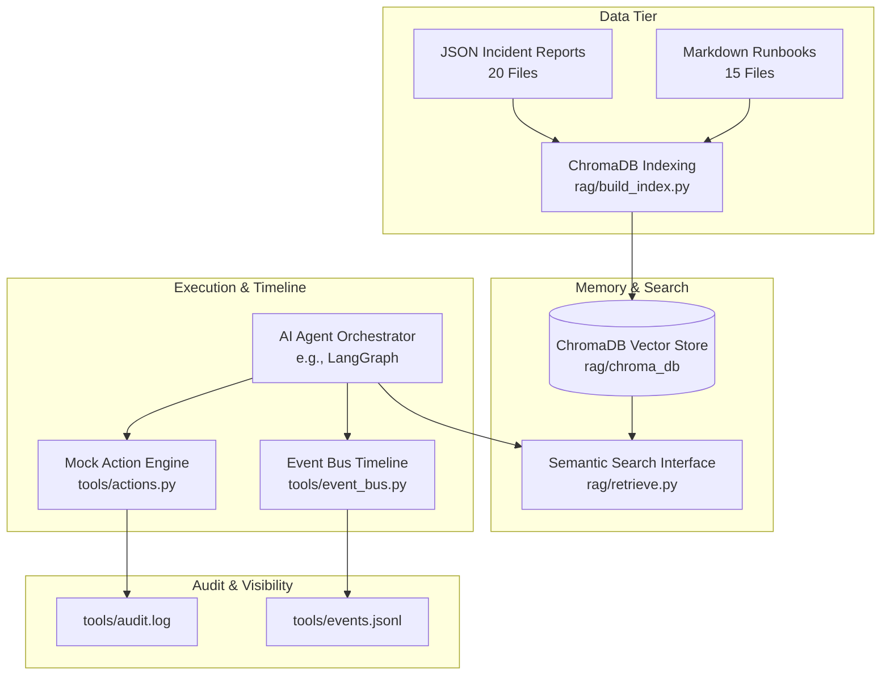

# AI Site Reliability Engineer (AI SRE) - RAG & Remediation Subsystem

[](https://www.python.org/)
[](https://www.trychroma.com/)
[](https://www.sbert.net/)
[]()

A production-grade Retrieval-Augmented Generation (RAG) and automated infrastructure remediation memory system built for an autonomous AI Site Reliability Engineering agent.

---

## 🏗 System Architecture



---

## 📁 Repository Directory Structure

```text
agentic_ops/
├── rag/
│   ├── data/
│   │   ├── incidents/         # 20 realistic synthetic incident JSON reports
│   │   └── runbooks/          # 15 operational Markdown runbooks
│   ├── chroma_db/             # Persistent ChromaDB vector store
│   ├── build_index.py         # Script to parse dataset & populate vector index
│   └── retrieve.py            # Public semantic retrieval interface: retrieve(query, k)
├── tools/
│   ├── actions.py             # Mock action execution engine & audit logger
│   ├── audit.log              # Appended JSON Lines audit log of executed actions
│   ├── event_bus.py           # Thread-safe event timeline engine
│   └── events.jsonl           # Appended JSON Lines timeline event stream
├── tests/
│   ├── test_retrieve.py       # Unit tests for retrieval layer
│   ├── test_actions.py        # Unit tests for action engine & parameter validation
│   └── test_event_bus.py      # Unit tests for thread-safe event bus
├── README.md                  # System documentation & usage guide
└── scratch/                   # Generation & verification utilities
```

---

## ⚡ Quick Start & Installation

### 1. Prerequisites
- Python 3.10+
- `pip` package manager

### 2. Install Dependencies

```bash
pip install chromadb sentence-transformers pytest pytest-cov
```

---

## 🛠 Usage & API Guide

### 1. Build the Vector Index

Populate the persistent ChromaDB collection (`sre_knowledge_base`) located at `rag/chroma_db/`:

```bash
python rag/build_index.py
```

*Output:*
```text
Loading incidents...
20 loaded

Loading runbooks...
15 loaded

Generating embeddings...
Creating Chroma collection...
Indexed 35 documents
Done.
```

---

### 2. Semantic Retrieval (`retrieve()`)

Query the knowledge base for top-$k$ relevant incidents and runbooks:

```python
from rag.retrieve import retrieve

# Perform semantic search
results = retrieve("Payment Gateway 504 timeout", k=2)

for item in results:
    print(f"[{item['score']:.4f}] {item['id']} ({item['document_type']}): {item['title']}")
```

#### CLI Demo
```bash
python rag/retrieve.py
```

---

### 3. Action Execution Engine (`execute_action()`)

Simulate infrastructure actions (restarts, rollbacks, scalings) with automatic audit logging to `tools/audit.log`:

```python
from tools.actions import execute_action

# Execute automated remediation action
response = execute_action(
    action_type="restart_service",
    params={"service": "payment-api"}
)

print(response)
# Output:
# {
#   "action_id": "f3b7beed-0d9b-432d-bf59-e84d8002b9db",
#   "action": "restart_service",
#   "status": "success",
#   "message": "Service 'payment-api' restarted successfully across all active worker instances.",
#   "timestamp": "2026-08-05T01:31:31.480000+00:00",
#   "execution_time_ms": 386,
#   "params": {"service": "payment-api"}
# }
```

#### Supported Actions
- `restart_service`
- `rollback_deployment`
- `restart_pod`
- `restart_database`
- `scale_deployment`
- `create_ticket`
- `notify_team`
- `generate_postmortem`

#### CLI Demo
```bash
python tools/actions.py
```

---

### 4. Event Bus & Live Timeline (`emit_event()`)

Publish agent lifecycle events to an in-memory queue and persist to `tools/events.jsonl`:

```python
from tools.event_bus import emit_event, get_events

# Publish lifecycle events
emit_event({
    "type": "incident_detected",
    "payload": {"service": "payment-api", "severity": "P1"}
})

emit_event({
    "type": "action_executed",
    "payload": {"action": "restart_service", "status": "success"}
})

# Retrieve timeline for dashboard display
timeline = get_events()
```

#### CLI Demo
```bash
python tools/event_bus.py
```

---

## 🧪 Testing & Code Coverage

Run the comprehensive unit test suite:

```bash
python -m pytest --cov=rag.retrieve --cov=tools.actions --cov=tools.event_bus tests/
```

*Results:*
```text
tests/test_actions.py .....                                             [ 33%]
tests/test_event_bus.py .....                                           [ 66%]
tests/test_retrieve.py ......                                           [100%]

---------- coverage: platform win32, python 3.12.10-final-0 -----------
Name                 Stmts   Miss  Cover
----------------------------------------
rag\retrieve.py         69      8    88%
tools\actions.py        77      9    88%
tools\event_bus.py      55      3    95%
----------------------------------------
TOTAL                  201     20    90%

============================== 15 passed in 5.66s ==============================
```

---

## 🔗 Future Integration with LangGraph

This module is designed as modular tool functions ready for binding into a LangGraph state machine agent:

```python
from langgraph.graph import StateGraph
from rag.retrieve import retrieve
from tools.actions import execute_action
from tools.event_bus import emit_event

# LangGraph node binding
def diagnose_node(state):
    emit_event({"type": "diagnosis_started", "payload": {"symptom": state["symptom"]}})
    retrieved_docs = retrieve(state["symptom"], k=3)
    return {"retrieved_docs": retrieved_docs}

def remediation_node(state):
    action_res = execute_action("restart_service", {"service": state["service"]})
    emit_event({"type": "action_executed", "payload": action_res})
    return {"remediation_result": action_res}
```

---

## ❓ Troubleshooting

1. **`ModuleNotFoundError: No module named 'chromadb'`**:
   Ensure `chromadb` is installed in the active environment via `python -m pip install chromadb`.

2. **ChromaDB Collection Empty**:
   Run `python rag/build_index.py` to populate the `sre_knowledge_base` collection from `rag/data/`.

3. **Unicode / Windows Console Output Errors**:
   The modules automatically reconfigure stdout to UTF-8 on Windows environments.

---

## 📜 License

MIT License - Open-source and free to adapt for hackathons or production AI SRE agents.
